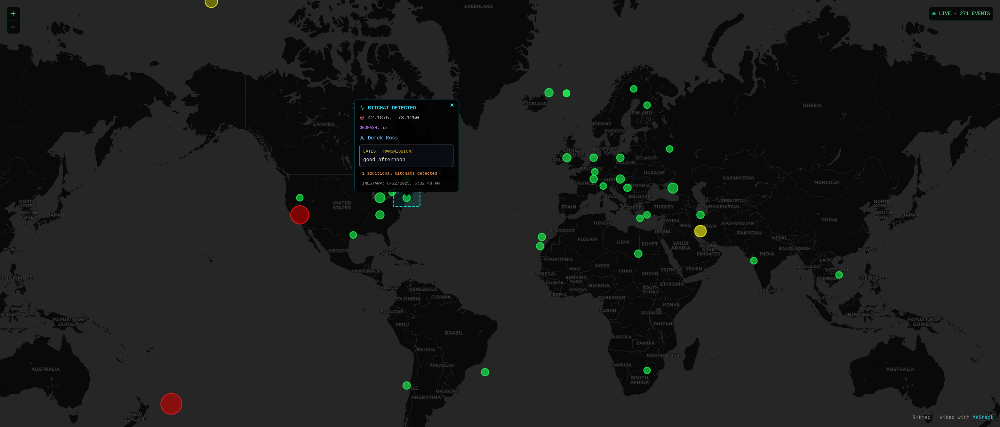

# Bitmap

Real-time Bitchat monitoring and visualization of ephemeral Nostr events with geospatial analysis. A heat map application that tracks and displays anonymous, location-based messages across the Nostr network.



## Features

- **Live Heat Map**: Real-time visualization of ephemeral events on an interactive map
- **Geospatial Analysis**: Events are clustered by location using geohash precision
- **Intensity Mapping**: Visual indicators show event density and activity hotspots
- **Anonymous Messaging**: Monitors kind 20000 ephemeral events for private, location-based communication
- **Dark Theme Interface**: Hacker-inspired UI with green-on-black color scheme

## Technology Stack

- **React 18.x**: Frontend framework with hooks and concurrent rendering
- **Nostrify**: Nostr protocol integration for event querying and publishing
- **Leaflet & React-Leaflet**: Interactive mapping capabilities
- **TailwindCSS**: Utility-first CSS styling
- **TanStack Query**: Data fetching, caching, and state management
- **TypeScript**: Type-safe development

## How It Works

Bitmap monitors ephemeral Nostr events (kind 20000) that contain:
- **Geohash tags** (`g`) for location precision
- **Nickname tags** (`n`) for optional user identification
- **Message content** in the event payload

The application clusters these events by location, visualizes them as heat map points with intensity-based coloring, and provides real-time updates every 10 seconds.

## Getting Started

### Prerequisites

- Node.js 18+
- npm or yarn

### Installation

```bash
# Install dependencies
npm install

# Start development server
npm run dev

# Build for production
npm run build

# Run tests
npm test
```

### Development

The application connects to Nostr relays to fetch ephemeral events. Default relay configuration can be modified in `src/App.tsx`.

## Project Structure

```
src/
├── components/
│   ├── EphemeralHeatMap.tsx    # Main heat map component
│   ├── NostrProvider.tsx      # Nostr integration
│   └── ui/                    # Shared UI components
├── hooks/
│   ├── useEphemeralEvents.ts  # Event fetching logic
│   └── useNostr.ts           # Nostr protocol hook
├── pages/
│   ├── Index.tsx             # Main application page
│   └── NIP19Page.tsx         # NIP-19 routing
└── contexts/                 # React context providers
```

## License

This project is part of the MKStack template ecosystem.